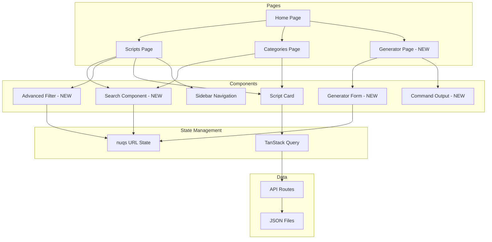

# Frontend Update Plan: Emulating community-scripts.org

## Overview

This plan outlines the updates needed to bring the ProxmoxVE frontend in line with the functionality and user experience of community-scripts.org while preserving the unique "Mechanicus" industrial theme (rust, brass, copper, corruption, iron colors).

## Goals

1. **Scripts Page Enhancement**: Add comprehensive search and filtering capabilities
2. **Categories Page Enhancement**: Add search and improved category browsing
3. **New Generator Page**: Create an unattended script generator for automated deployments
4. **Preserve Theme**: Maintain the Mechanicus aesthetic throughout all new features

---

## Architecture Diagram



---

## Implementation Tasks

### Phase 1: Scripts Page Enhancement

#### 1.1 Create Search Component
**File**: `frontend/src/components/search.tsx` (NEW)

Features:
- Debounced text input for searching script names and descriptions
- Real-time filtering as user types
- Clear button to reset search
- Mechanicus-themed styling with brass/copper accents

```typescript
// Key features:
- Search input with icon
- Debounce for performance
- URL state sync via nuqs
- Theme-aware styling
```

#### 1.2 Create Advanced Filter Component
**File**: `frontend/src/components/advanced-filter.tsx` (NEW)

Filter options:
- **Type**: LXC (ct), VM, PVE, Addon
- **Category**: Multi-select category filter
- **OS**: Alpine, Debian, Ubuntu, etc.
- **Resources**: CPU cores, RAM, HDD ranges
- **Status**: Active/Deprecated

#### 1.3 Update Scripts Page Layout
**File**: `frontend/src/app/scripts/page.tsx` (MODIFY)

Changes:
- Add search bar at top of content area
- Add filter panel (collapsible on mobile)
- Implement URL-based state for search/filters
- Add script count display
- Add "Clear Filters" button when filters active

#### 1.4 Create Filter State Management
**File**: `frontend/src/hooks/use-script-filters.ts` (NEW)

```typescript
interface FilterState {
  search: string;
  types: ScriptType[];
  categories: number[];
  os: string[];
  minCpu: number | null;
  maxCpu: number | null;
  minRam: number | null;
  maxRam: number | null;
  status: 'all' | 'active' | 'deprecated';
}
```

---

### Phase 2: Categories Page Enhancement

#### 2.1 Add Category Search
**File**: `frontend/src/app/categories/page.tsx` (MODIFY)

Features:
- Search bar for filtering categories by name
- Script count per category with real-time updates
- Category cards with hover effects (Mechanicus theme)
- Grid layout with responsive design

#### 2.2 Create Category Card Component
**File**: `frontend/src/components/category-card.tsx` (NEW)

Features:
- Category icon display
- Script count badge
- Active/deprecated script indicators
- Hover animations with Mechanicus styling

---

### Phase 3: Generator Page (NEW)

#### 3.1 Create Generator Page
**File**: `frontend/src/app/generator/page.tsx` (NEW)

Layout:
- Script selection dropdown/search
- Configuration form
- Generated command preview
- Copy to clipboard functionality

#### 3.2 Create Generator Form Component
**File**: `frontend/src/app/generator/_components/generator-form.tsx` (NEW)

Configuration options:
```
- Script Selection (dropdown with search)
- Hostname (text input)
- IP Address (text input with validation)
- Gateway (text input)
- DNS Servers (multi-input)
- CPU Cores (number input/slider)
- RAM (MB/GB selector)
- Disk Size (GB input)
- OS Selection (dropdown based on script)
- Network Type (DHCP/Static)
- SSH Options (enable/disable, port)
- Unprivileged Container (checkbox)
- Start After Creation (checkbox)
```

#### 3.3 Create Command Generator Logic
**File**: `frontend/src/lib/generate-command.ts` (NEW)

```typescript
// Generate bash command based on configuration
export function generateInstallCommand(config: GeneratorConfig): string {
  // Build command with flags based on user selections
  // Example: bash -c "$(wget -qLO - https://github.com/...)"
  // With environment variables for unattended installation
}
```

#### 3.4 Create Command Output Component
**File**: `frontend/src/app/generator/_components/command-output.tsx` (NEW)

Features:
- Syntax-highlighted bash command
- Copy button with feedback
- Command explanation tooltip
- Mechanicus-styled code block

---

### Phase 4: Shared Components

#### 4.1 Create Script Card Component
**File**: `frontend/src/components/script-card.tsx` (NEW - refactor from existing)

Features:
- Reusable card for scripts
- Logo, name, type badge
- Description with line clamp
- Quick action buttons (View, Generate)
- Mechanicus hover effects

#### 4.2 Create Pagination Component
**File**: `frontend/src/components/pagination.tsx` (NEW)

Features:
- Page navigation for script lists
- Items per page selector
- Total count display
- Mechanicus styling

---

## File Structure After Implementation

```
frontend/src/
├── app/
│   ├── generator/                    # NEW
│   │   ├── page.tsx
│   │   └── _components/
│   │       ├── generator-form.tsx
│   │       ├── command-output.tsx
│   │       ├── script-selector.tsx
│   │       └── config-fields.tsx
│   ├── scripts/
│   │   ├── page.tsx                  # MODIFIED
│   │   └── _components/
│   │       ├── sidebar.tsx
│   │       ├── script-item.tsx
│   │       ├── script-info-blocks.tsx
│   │       ├── script-accordion.tsx
│   │       ├── resource-display.tsx
│   │       ├── version-badge.tsx
│   │       └── quickfilter-bar.tsx   # NEW
│   ├── categories/
│   │   └── page.tsx                  # MODIFIED
│   └── ...
├── components/
│   ├── search.tsx                    # NEW
│   ├── advanced-filter.tsx           # NEW
│   ├── script-card.tsx               # NEW
│   ├── category-card.tsx             # NEW
│   ├── pagination.tsx                # NEW
│   └── ...
├── hooks/
│   ├── use-script-filters.ts        # NEW
│   ├── use-is-in-view.tsx
│   └── use-versions.ts
├── lib/
│   ├── generate-command.ts          # NEW
│   ├── filter-utils.ts              # NEW
│   ├── data.ts
│   └── types.ts
└── ...
```

---

## Technical Implementation Details

### URL State Management

Using `nuqs` for URL-based state:

```typescript
// Search state
const [search, setSearch] = useQueryState('search', { 
  defaultValue: '',
  parse: (value) => value || ''
});

// Filter state
const [types, setTypes] = useQueryState('types', {
  parse: (value) => value?.split(',').filter(Boolean) as ScriptType[],
  serialize: (value) => value.join(',')
});

// Pagination state
const [page, setPage] = useQueryState('page', {
  parse: (value) => parseInt(value || '1'),
  serialize: (value) => value.toString()
});
```

### Search Implementation

```typescript
// Debounced search hook
function useDebouncedSearch(delay: number = 300) {
  const [search, setSearch] = useQueryState('search');
  const [debouncedValue, setDebouncedValue] = useState(search);
  
  useEffect(() => {
    const timer = setTimeout(() => {
      setSearch(debouncedValue);
    }, delay);
    return () => clearTimeout(timer);
  }, [debouncedValue, delay, setSearch]);
  
  return [debouncedValue, setDebouncedValue];
}
```

### Filter Logic

```typescript
function filterScripts(scripts: Script[], filters: FilterState): Script[] {
  return scripts.filter(script => {
    // Search filter
    if (filters.search) {
      const searchLower = filters.search.toLowerCase();
      if (!script.name.toLowerCase().includes(searchLower) &&
          !script.description.toLowerCase().includes(searchLower)) {
        return false;
      }
    }
    
    // Type filter
    if (filters.types.length > 0 && !filters.types.includes(script.type)) {
      return false;
    }
    
    // Category filter
    if (filters.categories.length > 0) {
      const hasCategory = script.categories.some(c => filters.categories.includes(c));
      if (!hasCategory) return false;
    }
    
    // OS filter
    if (filters.os.length > 0) {
      const hasOS = script.install_methods.some(m => 
        filters.os.includes(m.resources.os || '')
      );
      if (!hasOS) return false;
    }
    
    // Resource filters
    if (filters.minCpu !== null || filters.maxCpu !== null) {
      const cpu = script.install_methods[0]?.resources.cpu;
      if (filters.minCpu !== null && cpu && cpu < filters.minCpu) return false;
      if (filters.maxCpu !== null && cpu && cpu > filters.maxCpu) return false;
    }
    
    // Status filter
    if (filters.status === 'active' && script.disable) return false;
    if (filters.status === 'deprecated' && !script.disable) return false;
    
    return true;
  });
}
```

### Generator Command Generation

```typescript
interface GeneratorConfig {
  script: Script;
  hostname: string;
  ip: string;
  gateway?: string;
  dns?: string[];
  cpuCores: number;
  ram: number;
  diskSize: number;
  os: string;
  networkType: 'dhcp' | 'static';
  sshEnabled: boolean;
  sshPort?: number;
  unprivileged: boolean;
  startAfterCreation: boolean;
}

function generateInstallCommand(config: GeneratorConfig): string {
  const baseUrl = 'https://raw.githubusercontent.com/community-scripts/ProxmoxVE/main';
  const scriptPath = config.script.install_methods[0].script;
  
  let command = `bash -c "$(wget -qLO - ${baseUrl}/${scriptPath})"`;
  
  // Add environment variables for unattended installation
  const envVars: string[] = [];
  
  if (config.hostname) {
    envVars.push(`HOSTNAME="${config.hostname}"`);
  }
  if (config.ip && config.networkType === 'static') {
    envVars.push(`IP="${config.ip}"`);
  }
  if (config.gateway && config.networkType === 'static') {
    envVars.push(`GATEWAY="${config.gateway}"`);
  }
  if (config.dns?.length) {
    envVars.push(`DNS="${config.dns.join(',')}"`);
  }
  if (config.cpuCores) {
    envVars.push(`CORES="${config.cpuCores}"`);
  }
  if (config.ram) {
    envVars.push(`RAM="${config.ram}"`);
  }
  if (config.diskSize) {
    envVars.push(`DISK_SIZE="${config.diskSize}"`);
  }
  if (config.sshEnabled && config.sshPort) {
    envVars.push(`SSH_PORT="${config.sshPort}"`);
  }
  
  if (envVars.length > 0) {
    command = `${envVars.join(' ')} ${command}`;
  }
  
  return command;
}
```

---

## Mechanicus Theme Integration

### Color Palette (Existing)
```css
--rust: #b7410e;
--brass: #b5a642;
--copper: #b87333;
--corruption: #8b0000;
--iron: #48494b;
```

### New Component Styling

All new components should use the existing theme classes:
- `bg-background` / `bg-card` / `bg-accent`
- `text-foreground` / `text-muted-foreground`
- `border-border` / `border-primary`
- Custom animations: `glitch`, `scan-line`, `rust-fall`

### Generator Page Styling

```tsx
// Example Mechanicus-styled generator form
<Card className="mechanicus-panel border-rust/30">
  <CardHeader className="border-b border-rust/20">
    <CardTitle className="text-brass">Script Configuration</CardTitle>
  </CardHeader>
  <CardContent className="space-y-4">
    {/* Form fields with copper accents */}
    <div className="space-y-2">
      <Label className="text-copper">Hostname</Label>
      <Input className="border-rust/30 focus:border-brass" />
    </div>
  </CardContent>
</Card>
```

---

## Testing Checklist

### Scripts Page
- [ ] Search filters scripts correctly
- [ ] Advanced filters work independently and combined
- [ ] URL state persists on page refresh
- [ ] Clear filters button resets all filters
- [ ] Pagination works with filters
- [ ] Mobile responsive layout
- [ ] Mechanicus theme preserved

### Categories Page
- [ ] Search filters categories correctly
- [ ] Category cards display correct counts
- [ ] Navigation to scripts page works
- [ ] Mobile responsive layout
- [ ] Mechanicus theme preserved

### Generator Page
- [ ] Script selection works
- [ ] All configuration fields work
- [ ] Command generates correctly
- [ ] Copy to clipboard works
- [ ] URL state for sharing configurations
- [ ] Mobile responsive layout
- [ ] Mechanicus theme preserved

---

## Estimated Effort

| Task | Complexity | Priority |
|------|------------|----------|
| Search Component | Medium | High |
| Advanced Filter | Medium | High |
| Scripts Page Update | Medium | High |
| Categories Page Update | Low | Medium |
| Generator Page | High | High |
| Command Generator | Medium | High |
| Testing | Medium | High |

---

## Dependencies

All required dependencies are already installed:
- `nuqs` - URL state management
- `@tanstack/react-query` - Data fetching
- `lucide-react` - Icons
- `tailwindcss` - Styling
- `framer-motion` - Animations

No new dependencies needed.

---

## Next Steps

1. Switch to Code mode to begin implementation
2. Start with Phase 1 (Scripts Page Enhancement)
3. Create new components incrementally
4. Test each component as it's built
5. Move to next phase after each phase is complete

---

## Questions for Consideration

1. Should the generator support saving/loading configurations?
2. Should there be a "favorites" feature for scripts?
3. Should search results show highlighted matches?
4. Should there be keyboard shortcuts for navigation?
