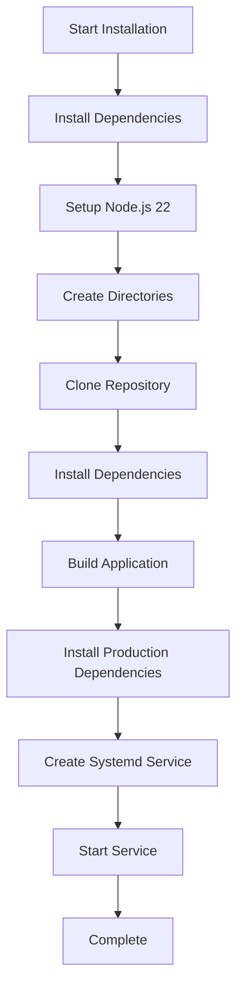
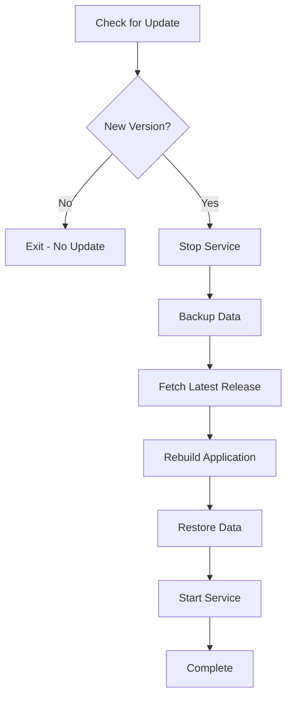

# Maintainerr Bare-Metal Installation Plan

## Overview

**Application:** Maintainerr  
**Description:** A tool to automatically manage media collections in Plex/Jellyfin/Emby by syncing with Radarr/Sonarr  
**Repository:** https://github.com/Maintainerr/Maintainerr  
**License:** MIT  
**Port:** 6246  
**Category:** Media & Streaming (13) or *Arr Suite (14)

## Technical Analysis

### Architecture
- **Type:** Node.js monorepo using Turborepo
- **Framework:** NestJS backend + React/Vite frontend
- **Database:** SQLite (better-sqlite3)
- **Node.js Version:** Requires Node.js ^20.19.0 or >=22.12.0 (Dockerfile uses Node 24.14.0)
- **Package Manager:** Yarn 4.11.0 (via corepack)
- **Build Tool:** Turborepo

### Build Process (from Dockerfile)
1. Enable corepack for Yarn
2. Install dependencies with `yarn install`
3. Build with `yarn turbo build`
4. Production install with `yarn workspaces focus --all --production`
5. Run with `node apps/server/dist/main.js`

### Key Directories
- `/opt/maintainerr` - Application directory
- `/opt/maintainerr/data` - Data directory (config, database, logs)
- `/opt/maintainerr/apps/server/dist` - Built server
- `/opt/maintainerr/apps/server/dist/ui` - Built frontend

### Environment Variables
| Variable | Default | Description |
|----------|---------|-------------|
| TZ | host timezone | Date formatting in logs |
| UI_HOSTNAME | 0.0.0.0 | Listen host |
| UI_PORT | 6246 | Listen port |
| BASE_PATH | - | Subfolder for reverse proxy |
| DATA_DIR | /opt/data | Data directory |
| NODE_ENV | production | Environment mode |

## Installation Strategy

### Prerequisites
- Node.js 22+ (using `setup_nodejs` function)
- Python3 and build-essential (for native module compilation)
- SQLite3 development libraries

### Installation Steps



### Update Strategy



## Files to Create

### 1. ct/maintainerr.sh
Container script with:
- App configuration (CPU: 2, RAM: 2048, Disk: 8)
- Update function using git-based updates
- Standard header and footer

### 2. install/maintainerr-install.sh
Installation script with:
- Dependency installation (build-essential, python3, sqlite3)
- Node.js 22 setup via `setup_nodejs`
- Repository clone and build
- Systemd service creation
- Data directory setup

### 3. frontend/public/json/maintainerr.json
Metadata file with:
- Category: 13 (Media & Streaming) or 14 (*Arr Suite)
- Port: 6246
- Documentation and website links
- Installation notes

### 4. ct/headers/maintainerr
Header file for the application

## Resource Requirements

| Resource | Value | Notes |
|----------|-------|-------|
| CPU | 2 cores | Moderate for media processing |
| RAM | 2048 MB | Sufficient for Node.js app |
| Disk | 8 GB | App + dependencies + data |
| OS | Debian 13 | Standard LXC template |
| Unprivileged | 1 | No special privileges needed |

## Systemd Service Configuration

```ini
[Unit]
Description=Maintainerr - Media Collection Manager
After=network.target

[Service]
Type=simple
User=root
WorkingDirectory=/opt/maintainerr
Environment=NODE_ENV=production
Environment=DATA_DIR=/opt/maintainerr/data
Environment=UI_PORT=6246
Environment=UI_HOSTNAME=0.0.0.0
ExecStart=/usr/bin/node apps/server/dist/main.js
Restart=on-failure
RestartSec=5

[Install]
WantedBy=multi-user.target
```

## Notes for Implementation

1. **Native Module Compilation:** The `better-sqlite3` package requires Python and build tools for compilation. Must install `python3`, `make`, `g++` before npm install.

2. **Yarn Version:** Must use Yarn 4.x via corepack. The `setup_nodejs` function should handle this, but may need to enable corepack explicitly.

3. **Build Time:** The build process may take several minutes. Consider using `CLEAN_INSTALL=1` with `fetch_and_deploy_gh_release` if available as prebuilt.

4. **Data Persistence:** The data directory contains SQLite database and configuration. Must be backed up during updates.

5. **Update Method:** Since Maintainerr uses semantic-release, we can use `check_for_gh_release` for version checking and git-based updates for the actual update process.

## Questions for User

1. Should we use category 13 (Media & Streaming) or 14 (*Arr Suite)? Maintainerr integrates with Radarr/Sonarr so *Arr Suite might be more appropriate.

2. The build process requires compiling native modules. Should we increase RAM to 4096 MB for the build phase, or is 2048 MB sufficient?

3. Would you like to include any specific configuration defaults in the installation?
