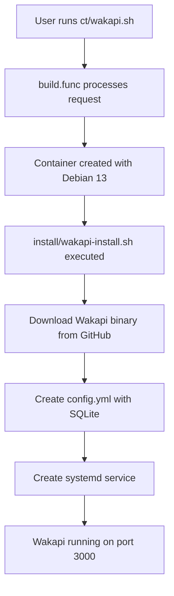

# Wakapi ProxmoxVE Script Plan

## Overview

This plan outlines the creation of a ProxmoxVE community script for deploying **Wakapi** - a minimalist, self-hosted WakaTime-compatible backend for coding statistics.

- **Source**: https://github.com/muety/wakapi
- **Website**: https://wakapi.dev
- **License**: MIT
- **Language**: Go
- **Default Port**: 3000

## Architecture



## Files to Create

### 1. ct/wakapi.sh

Main container creation script that:
- Defines container resources: 2 CPU, 2GB RAM, 8GB disk
- Uses Debian 13 as base OS
- Implements update_script function for version updates
- Sources build.func from the repository

**Key Configuration:**
```bash
APP="Wakapi"
var_tags="productivity;analytics"
var_cpu="2"
var_ram="2048"
var_disk="8"
var_os="debian"
var_version="13"
var_unprivileged="1"
```

### 2. install/wakapi-install.sh

Installation script that:
- Downloads the latest Wakapi binary from GitHub releases
- Creates necessary directories: /opt/wakapi
- Generates configuration file with SQLite backend
- Creates systemd service for automatic startup
- Generates a secure password salt

**Installation Steps:**
1. Install dependencies: ca-certificates
2. Download Wakapi binary using fetch_and_deploy_gh_release
3. Create /opt/wakapi directory
4. Generate config.yml with:
   - SQLite database
   - Random password salt
   - Proper security settings
5. Create systemd service
6. Enable and start service

### 3. ct/headers/wakapi

ASCII art header for the script output.

### 4. frontend/public/json/wakapi.json

Metadata file containing:
- Application name and slug
- Categories: productivity, analytics
- Installation methods
- Default credentials info
- Documentation links

## Configuration Details

### Wakapi Configuration (config.yml)

```yaml
env: production
server:
  port: 3000
  listen_ipv4: 0.0.0.0
  public_url: http://localhost:3000

security:
  password_salt: <generated>
  insecure_cookies: true
  allow_signup: true

db:
  dialect: sqlite3
  name: /opt/wakapi/data/wakapi.db
```

### Systemd Service

```ini
[Unit]
Description=Wakapi - Coding Statistics
After=network.target

[Service]
Type=simple
User=root
WorkingDirectory=/opt/wakapi
ExecStart=/opt/wakapi/wakapi -config /opt/wakapi/config.yml
Restart=on-failure
RestartSec=5

[Install]
WantedBy=multi-user.target
```

## Update Strategy

The update_script function will:
1. Check current version against GitHub releases
2. Stop the Wakapi service
3. Backup the config.yml and data directory
4. Download new binary
5. Restore configuration
6. Restart service

## Resource Requirements

| Resource | Value | Notes |
|----------|-------|-------|
| CPU | 2 cores | Sufficient for personal use |
| RAM | 2GB | Adequate for SQLite backend |
| Disk | 8GB | Stores binary, config, and database |
| OS | Debian 13 | Latest stable |

## Post-Installation

After installation, users need to:
1. Access Wakapi at http://IP:3000
2. Create an account (first user becomes admin)
3. Configure WakaTime client with:
   - API URL: http://IP:3000/api
   - API Key: From user settings

## Notes for Implementation

1. **Binary Selection**: Wakapi provides pre-built binaries for Linux amd64/arm64. Use the appropriate binary based on architecture.

2. **Password Salt**: Generate a random 32-character salt for password hashing.

3. **Data Persistence**: The SQLite database is stored in /opt/wakapi/data/ which persists across updates.

4. **No Default Credentials**: Wakapi requires user registration on first access - no default username/password.

5. **Categories**: Use category IDs from the project - likely productivity and analytics related.

## Implementation Checklist

- [ ] Create ct/wakapi.sh with update_script function
- [ ] Create install/wakapi-install.sh with binary download and config
- [ ] Create ct/headers/wakapi ASCII art
- [ ] Create frontend/public/json/wakapi.json metadata
- [ ] Test the scripts in a Proxmox environment
